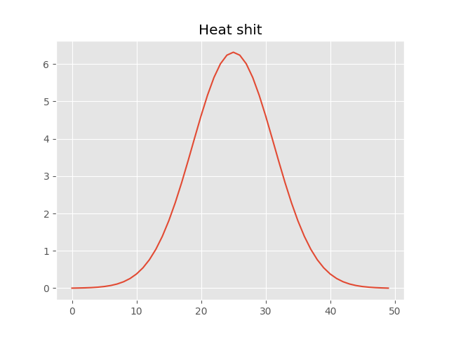

# 1D Heat Diffusion Simulation
A simple numerical simulation of the 1-D heat equation using finite-difference methods in NumPy.

**Equation:**

$$
\frac{\partial T}{\partial t} = \alpha \frac{\partial^2 T}{\partial x^2}
$$

**Files:**
- `plot.py`: core simulation.
- `requirements.txt`: dependencies.

Run: python plot.py
